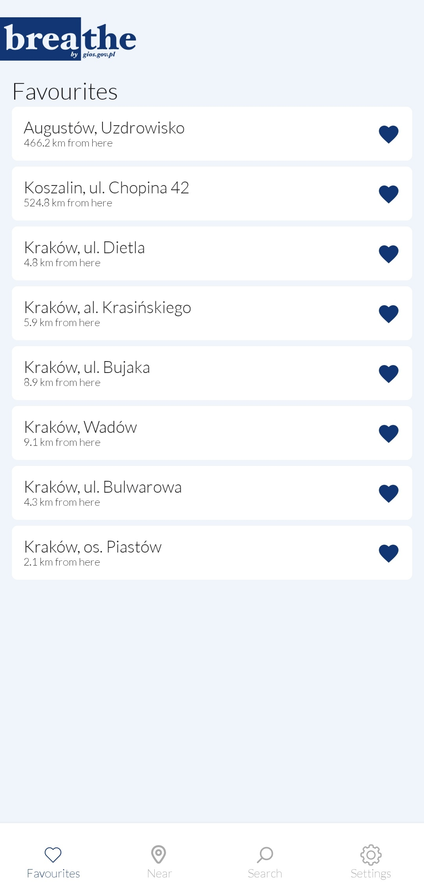
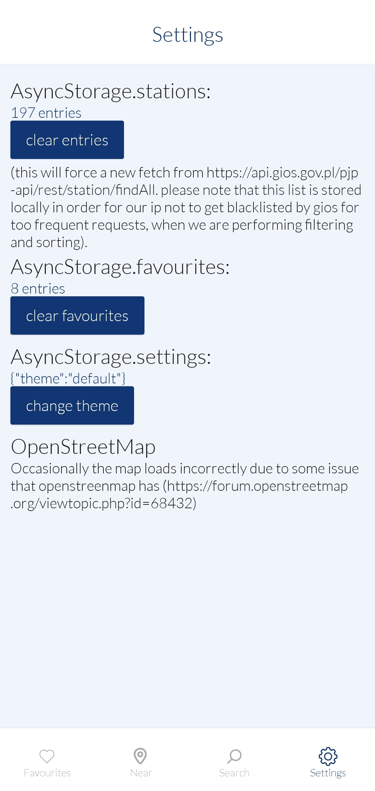
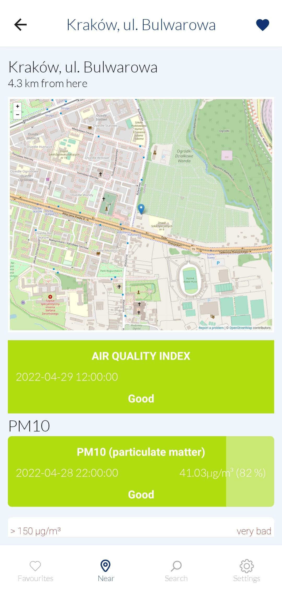
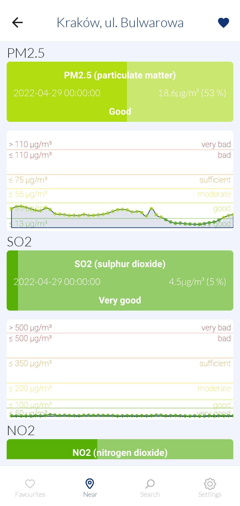

# react-native-airqualityinpoland
> This is my first project in react native used to monitor air quality in Poland using state system of sensors exposed via REST API [https://powietrze.gios.gov.pl/pjp/content/api](https://powietrze.gios.gov.pl/pjp/content/api).
> You can see the live demo of the app working here [https://snack.expo.dev/@vesolovski/react-native-airqualityinpoland](https://snack.expo.dev/@vesolovski/react-native-airqualityinpoland).

## Table of Contents
* [Features](#features)
* [Project Status](#project-status)
* [Room for Improvement](#room-for-improvement)
* [Screenshots](#screenshots)
* [Contact](#contact)

## Features
List of features:
- fetching data from REST API
- using AsynStorage to have the not-too-frequently-changing data cached instead of having to every time fetch the api
- using openstreetmap for map layer
- using lottiefiles for tab animations
- using themes provided by '@react-navigation/native' library

## Project Status
Project is: _in progress_ .

## Room for Improvement
Room for improvement:
- reorganizing the code to bring more tidiness and improve logic
- using other sensor providers, not only state governed
- incorporating Google Maps API
- creating maps with multiple stations and with color scales

## Screenshots
| List of stations | Settings | Details of station | Details of station |
| --- | --- | --- | --- |
|  |  |  |  |

## Contact
In case of any questions please feel free to contact me: krzysztof.wesolowski(HERE_PUT_THE_AT_SIGN)pk.edu.pl
